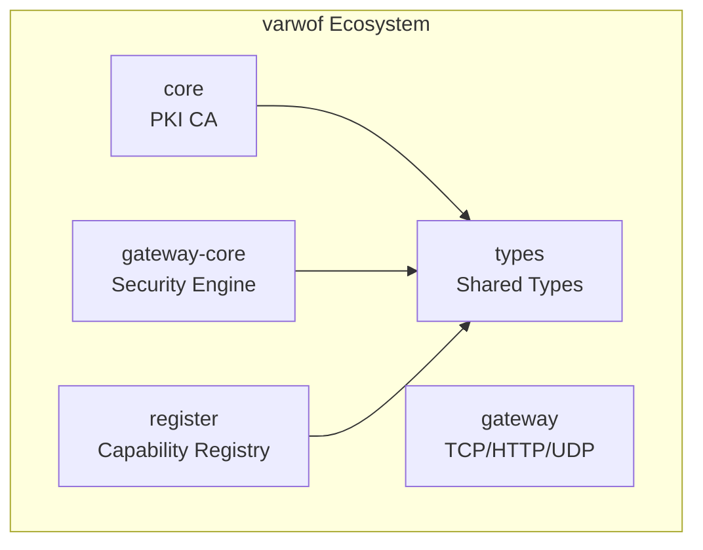

# varwof-types

> Shared type definitions for AIC / Capability / PrincipalUid / DelegationAuthorization in the varwof PKI suite.

> ⚠️ **Preview** — Not for production use. APIs and features may change before official release.

[](LICENSE)
[](https://pkg.go.dev/github.com/varwof/types)

[中文](README_CN.md)

## What is varwof-types?

Core shared type definitions for the varwof PKI suite: AIC (Agent Identity Certificate), Capability, PrincipalUid (SPKI key hash), DelegationAuthorization, PrincipalAuthorization, and more. Zero external dependencies. Referenced by core, gateway-core, register, and all other modules.

## Quick Start

```go
import pki "github.com/varwof/types"

// Parse AIC from certificate
aic, err := pki.ParseAIC(cert)

// Validate AIC
err = pki.ValidateAIC(aic)

// Match capability with glob pattern
matched := pki.MatchCapability("oracle/mysql:query:users", "oracle/*:query:*")
```

## Installation

```bash
go get github.com/varwof/types@v0.1.0
```

## Core Types

| Type | Description |
|------|-------------|
| `AIC` | Agent Identity Certificate extension structure |
| `Capability` | Capability declaration (schemeId + capabilityId) |
| `PrincipalUid` | Principal identifier (SPKI public key hash) |
| `DelegationAuthorization` | Delegation authorization signature (timestamp + nonce) |
| `PrincipalAuthorization` | Principal authorization policy |
| `GatewaySessionExtension` | Gateway session execution constraints |
| `MatchCapability` | Capability glob pattern matching |
| `ValidateAIC` | AIC validation |

## Sub-packages

| Package | Description |
|---------|-------------|
| `aicjwt` | AIC-JWT (`draft-wei-aic-jwt-00`) claims model, JWS sign/verify, 11-step validation pipeline |

## Ecosystem



types is the **type foundation layer** of the varwof ecosystem. This project is a member of the [Open Invention Network](https://openinventionnetwork.com/).

## Links

| | |
|---|---|
| Homepage | https://varwof.com |
| Community | https://varwof.org |
| IETF Draft | [draft-wei-aic-identity-cert](https://datatracker.ietf.org/doc/draft-wei-aic-identity-cert/) |
| AIC X.509 (docs) | [draft-wei-aic-identity-cert-00.md](docs/draft-wei-aic-identity-cert-00.md) (also `.xml` / `.txt` / `.html`) |
| AIC-JWT (docs) | [draft-wei-aic-jwt-00.md](docs/draft-wei-aic-jwt-00.md) (also `.xml` / `.txt` / `.html`) |
| License | Apache-2.0 |
| Member | [Open Invention Network](https://openinventionnetwork.com/) |
