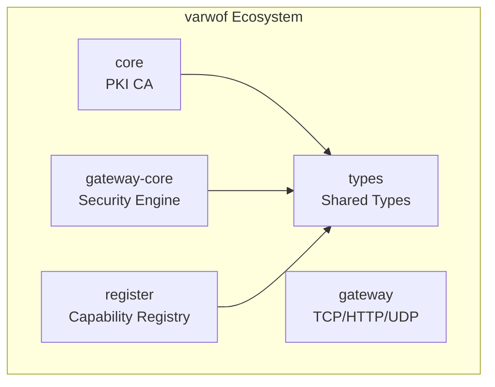

# varwof-types

> Part of the Varwof AIC suite — flagship repos: [aic-agent](https://github.com/varwof/aic-agent) · [aic-verifier](https://github.com/varwof/aic-verifier) · [aic-exec](https://github.com/varwof/aic-exec)

> Shared type definitions for AIC / Capability / PrincipalUid / DelegationAuthorization in the varwof PKI suite, including the AIC-JWT Delegation Authorization claim set (`da.ver=3`).

> ⚠️ **Preview** — Not for production use. APIs and features may change before official release.

[](LICENSE)
[](https://pkg.go.dev/github.com/varwof/types)

[中文](README_CN.md)

## What is varwof-types?

Core shared type definitions for the varwof PKI suite: AIC (Agent Identity Certificate), Capability, PrincipalUid (SPKI key hash), DelegationAuthorization, PrincipalAuthorization, and more. Zero external dependencies. Referenced by core, gateway-core, register, and all other modules.

## Quick Start

```go
import pki "github.com/varwof/types"

// Parse AIC from certificate
aic, err := pki.ParseAIC(cert)

// Validate AIC
err = pki.ValidateAIC(aic)

// Match capability with glob pattern
matched := pki.MatchCapability("acme/mysql-v1:query:users", "acme/mysql-v1:query:*")
```

## Installation

```bash
go get github.com/varwof/types@v0.7.0
```

## Core Types

| Type | Description |
|------|-------------|
| `AIC` | Agent Identity Certificate extension structure |
| `Capability` | Capability declaration (schemeId + capabilityId) |
| `PrincipalUid` | Principal identifier (SPKI public key hash) |
| `DelegationAuthorization` | Delegation authorization signature (timestamp + nonce); DA version 2 carries the principal-signed `AgentKeyBinding` (agent SPKI hash) in `DelegationAuthTBS` - v1 must omit it, v2 must carry it, and newly issued DAs are v2 |
| `PrincipalAuthorization` | Principal authorization policy |
| `GatewaySessionExtension` | Gateway session execution constraints |
| `SupervisionEvent` | Unified pre/mid/post-operation supervision record (consent/denied/step_up/approval/break_glass/override) |
| `MatchCapability` | Capability glob pattern matching |
| `ValidateAIC` | AIC validation |

### Delegation Authorization versions

The two carriers use different version numbers for the same Delegation
Authorization lineage (AIC-JWT -02 Section 5.4):

| Carrier | Current | Legacy | Agent-key binding |
|---|---|---|---|
| X.509 AIC (`DelegationAuthTBS.version`) | v2 | v1 | `AgentKeyBinding`: `keyHash` = `hashAlgo(agent SPKI)`, hash algorithm defaults to SHA-256; required in v2, must be absent in v1 |
| AIC-JWT (`da.ver`) | 3 | 2 | `agent_key_binding`: `{hash_alg, key_hash}` with `key_hash` = base64url(`hash_alg(SPKI DER)`); required in `da.ver=3`, must be absent in `da.ver=2` |

Mapping: X.509 AIC DA v1 <-> JWT `da.ver=2`; X.509 AIC DA v2 <-> JWT
`da.ver=3`.  Newly issued delegations use the current version in both
carriers, and any other version value is rejected.

## Sub-packages

| Package | Description |
|---------|-------------|
| `aicjwt` | AIC-JWT (`draft-wei-aic-jwt-02`) DA claim set (`da.ver=3` with `agent_key_binding`; `da.ver=2` is the legacy claim set), JWS sign/verify, 11-step validation pipeline |

## Ecosystem


```mermaid
graph TB
    subgraph varwof["varwof Ecosystem"]
        core["core<br/>PKI CA"]
        gw["gateway<br/>TCP/HTTP/UDP"]
        gwcore["gateway-core<br/>Security Engine"]
        types["types<br/>Shared Types"]
        reg["register<br/>Capability Registry"]
    end
    core --> types
    gwcore --> types
    reg --> types
```

types is the **type foundation layer** of the varwof ecosystem. This project is a member of the [Open Invention Network](https://openinventionnetwork.com/).

## Links

| | |
|---|---|
| Homepage | https://varwof.com |
| Community | https://varwof.org |
| IETF Draft | [draft-wei-aic-identity-cert](https://datatracker.ietf.org/doc/draft-wei-aic-identity-cert/) |
| AIC X.509 (docs) | [draft-wei-aic-identity-cert-02.md](docs/draft-wei-aic-identity-cert-02.md) (also `.xml` / `.txt` / `.html`) |
| AIC-JWT (docs) | [draft-wei-aic-jwt-02.md](docs/draft-wei-aic-jwt-02.md) (also `.xml` / `.txt` / `.html`) |
| License | Apache-2.0 |
| Member | [Open Invention Network](https://openinventionnetwork.com/) |

## Community

Questions, feedback, and port status: [AIC Discussions](https://github.com/varwof/aic-jwt/discussions)
